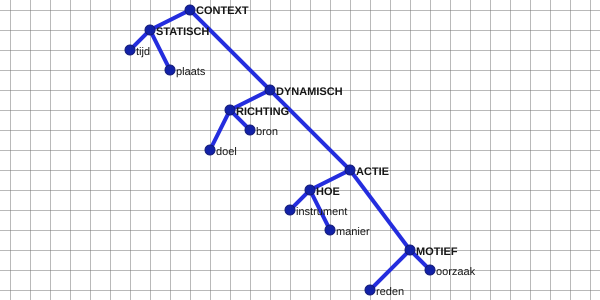

# Context · Open Graph Notation en semantische indeling

**Context** is de naam voor alles rondom de centrale **Text**. De aangeleverde
referentieboom wordt daarom normatief gelezen met **CONTEXT** als wortel.
**Context is zelf ook Open Graph Notation:** de Context-boom is een eigen,
**geminimaliseerde boom**, naast en onderscheiden van de centrale Text-OGN.
De volledige boom hieronder is uitsluitend de beschikbare referentievoorraad.



## Takken

| Bovenliggende categorie | Onderverdeling | Functie |
|---|---|---|
| `CONTEXT` | `STATISCH`, `DYNAMISCH` | hoofdonderscheid binnen de context |
| `STATISCH` | `TIJD`, `PLAATS` | statische situering |
| `DYNAMISCH` | `RICHTING`, `ACTIE` | dynamische situering |
| `RICHTING` | `DOEL`, `BRON` | richting van of naar een locatie of toestand |
| `ACTIE` | `HOE`, `MOTIEF` | uitvoering of aanleiding van een handeling |
| `HOE` | `INSTRUMENT`, `MANIER` | middel of wijze |
| `MOTIEF` | `REDEN`, `OORZAAK` | intentionele reden of causale aanleiding |

De boom is een **Context**-indeling, geen uitbreiding van de centrale
Language Tree. De centrale boom blijft **Text** en bevat uitsluitend zijn
eigen structurele deelnemers en predicaten. Context heeft zijn eigen
OGN-knopen en zijn eigen graphstructuur; die knopen worden niet ongemerkt aan
de Text-boom toegevoegd.

## Geminimaliseerde boom

Een toekomstige concrete Context-OGN wordt **geminimaliseerd** opgebouwd:

1. behoud de wortel `CONTEXT`;
2. activeer uitsluitend Context-categorieën die voor de uiting werkelijk
   relevant zijn;
3. behoud alleen het noodzakelijke pad naar iedere actieve categorie;
4. laat alle ongebruikte zusters en zijtakken weg;
5. bereken het resultaat als zelfstandige, geldige OGN.

Bij een uiting met uitsluitend tijd blijft bijvoorbeeld alleen het relevante
pad `CONTEXT → STATISCH → TIJD` over; `PLAATS`, `RICHTING`, `HOE` en
`MOTIEF` worden dan niet automatisch gebouwd. Welke waardeknopen,
LEX-inserties of Text–Context-koppelingen daarbij later nodig zijn, wordt
nog niet vastgelegd.

## OGN-invariant

Voor de Context-OGN geldt hetzelfde algemene contract als voor iedere andere
Open Graph Notation:

```text
A ≠ B  ⇒  x(A) ≠ x(B)  én  y(A) ≠ y(B)
```

Iedere Context-knoop heeft dus één eigen horizontale en één eigen verticale
rasterlijn. De normatieve SVG bevat vijftien Context-knopen; geen twee delen
een rasterrij of rasterkolom. De invariant geldt per afzonderlijke OGN: de
Text-OGN en de Context-OGN behouden ieder hun eigen identiteit.

## Verhouding tot de bestaande voorbeelden

- `GISTEREN` en `VANDAAG` zijn Context-inserties die inhoudelijk bij
  `STATISCH → TIJD` horen.
- `ER` is een Context-insertie voor plaats; de concrete plaatsreferent blijft
  onbepaald.
- `NIET MEER` is een Context-insertie voor toestand; de verdere Context-indeling
  daarvan blijft nog open.
- Een expliciete plaatsbepaling zou inhoudelijk bij `STATISCH → PLAATS` horen.
- `OMDAT` is een Context-insertie. Of het concrete verband `REDEN` of
  `OORZAAK` is, wordt niet automatisch gekozen.
- `HIJ` en `HEM` zijn geen Context-inserties: zij zijn anaforische
  LEX-realisaties van bestaande centrale **Text**-knopen.

## Implementatiegrens

Deze Context-OGN is vooralsnog een gedocumenteerde referentiestructuur. Er is
nog geen actieve Context-plaatsingsengine, geen actief relatieschema tussen
Text-OGN en Context-OGN en geen automatisch categoriseringsmechanisme. De
nadere implementatie van Context als geminimaliseerde boom blijft **p.m.**

Config reserveert uitsluitend de bedoeling:

```json
{
  "context": {
    "notation": "Open Graph Notation",
    "representation": "minimized-tree",
    "status": "p.m."
  }
}
```

Dit is geen actief Context-schema en berekent nog geen Context-knooppunten.

De originele, door de gebruiker aangeleverde afbeelding is bewaard als
`references/context-taxonomy-source.png`; de normatieve versie met de juiste
wortelnaam staat in `references/context-taxonomy.svg`.
