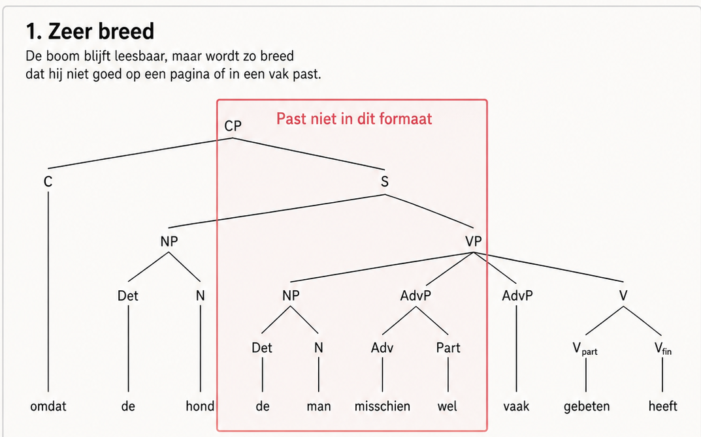
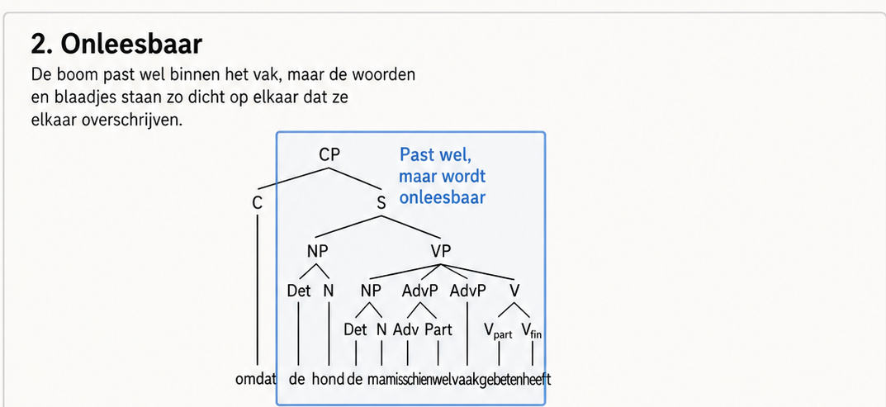
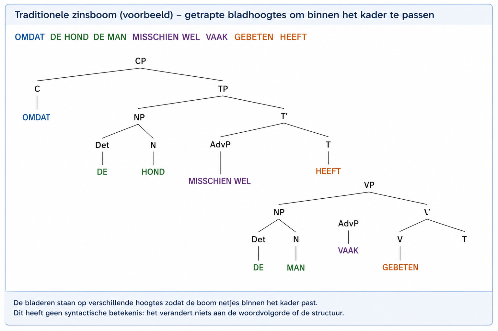
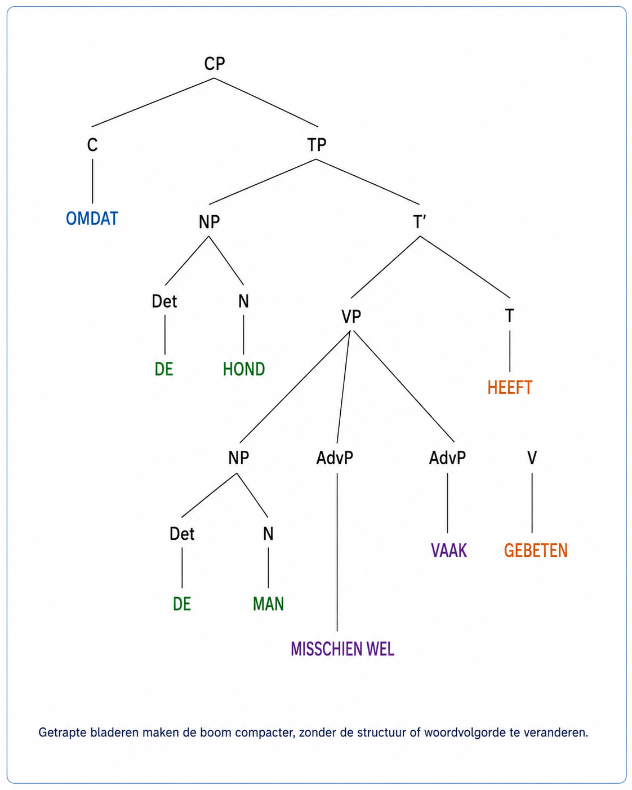

# OpenGraph Lite Viewer v2.0.0-rc.43

OpenGraph Lite Viewer is een demo/viewer voor JAN-, OPN- en
OpenGraph-taalstructuren. Deze versie gebruikt de volledige v1.0.16-bronset als
functionele basis.

Engelse documentatie: [`README.md`](README.md).

> **Controlestatus:** rc.43 is een releasekandidaat die nog handmatig visueel
> moet worden goedgekeurd. De goedgekeurde rc.41-bron blijft ongewijzigd. De
> automatische controles bewaken geometrie en feature-invarianten, maar
> vervangen geen menselijk oordeel over leesbaarheid en duidelijkheid.

## OGN Basis, voorconfig en toepassingen

De viewer start voortaan in **OGN Basis**. Dit profiel bevat de gewone
Syntax-/Functional-boom, het raster, de projecties LEX/SYNT/LOG met de majors
S/O/V en voorbeelden zonder optionele inserties. Insertie staat standaard uit
op LEX, SYNT en LOG.

`Config → Voorconfig` schakelt insertie per as onafhankelijk aan of uit. Deze
voorconfig voegt zelf nog geen taalinhoud toe. Daarna bevat
`Config → Toepassingen` als eerste toepassing **Bijwoorden**. Die wordt pas
beschikbaar wanneer insertie op **LEX + LOG** actief is. Staat Bijwoorden uit,
dan ontbreken de bijbehorende voorbeelden, LOG-minors, directe LEX-inserties,
bediening, runtimegegevens, documentatielinks en exportvelden. Een OPN-export
vermeldt dan `profile: "base"`, `extras: []` en de drie asschakelaars.

Config toont daarnaast drie uitgeschakelde reserveringen voor latere
toepassingen: **Vraagzin**, **Nadruk** (bijvoorbeeld `juist díe trui`) en
**Onaffe zin**. Ze staan bewust buiten de actieve featurecatalogus en voegen
daarom geen state, voorbeelden, inserties, documentatie, opslag, exportvelden
of rendergedrag toe.

## Bewerkbare LEESMIJ-items en carousels

`Config → LEESMIJ-items` bewerkt het volledige item en niet alleen de beelden.
Ieder onderwerp heeft **Tonen: ja/nee**, een navigatietitel NL/EN en inhoud
NL/EN in beperkte veilige HTML. Nee verbergt het item zonder het te
verwijderen; in Config blijft het dus terugvindbaar. Scripts, formulieren,
styles, frames, event-attributen en onveilige linkschema’s worden vóór
weergave verwijderd.

Dezelfde editor beheert de carousel: actieve slide toevoegen/verwijderen,
vorige/volgende, breed/smal, alt-tekst en onderschrift NL/EN, live
voorvertoning en volledig herstel van het item. Een gewoon beeldpad of
https-URL blijft mogelijk. Onder `Config → Bestanden & export` kan daarnaast
een lokale PNG, JPEG, WebP of GIF rechtstreeks als ingesloten slide worden
ingevoegd. De grens is 1,25 MB per beeld en ook de totale ingesloten opslag is
begrensd. Een handmatig getypte `data:`-URL blijft geblokkeerd; alleen de
vertrouwde bestandsroute mag een ingesloten beeld maken.

De gezamenlijke Config-savebalk staat boven ieder Config-onderdeel. Titel,
itemtekst, Tonen ja/nee en carousel worden samen bewaard. Graph-sneltoetsen
blijven uit zolang Config of LEESMIJ openstaat en wanneer een invoerveld focus
heeft.

## Standaardconfig, project-user-config en browser-Config

Iedere volledige projectzip bevat
`config/default-config.json` én `config/user-config.json`. De viewer past eerst
de standaard toe en daarna de ingeschakelde user-config als overschrijving.
De standaard wordt dus niet fysiek vervangen.

Start via `start_local_viewer.bat` en kies
`Config → Bestanden & export → Schrijf huidige Config naar project`. De lokale
server schrijft de actuele snapshot via een vaste allowlist naar
`config/user-config.json`; dat bestand gaat daarna mee in de volgende
volledige bronzip. Op een gewone webserver gebruik je
`Download user-config` en plaats je het bestand handmatig in `config/`.

De voorrang is:

```text
code-defaults → config/default-config.json → config/user-config.json
→ lokaal bewaarde browser-Config
```

De laatste browsersnapshot blijft apparaatgebonden totdat hij naar het
projectbestand wordt geschreven.

## Kant-en-klare publicatieteksten

Iedere projectzip bevat [`PUBLICATIE_README.md`](PUBLICATIE_README.md) met
kopieerbare Nederlandse en Engelse teksten voor LinkedIn, Reddit, Facebook,
YouTube, Bluesky, Mastodon, X en een GitHub-release. Vervang vóór plaatsing de
gemarkeerde live-, bron- en videolinks. De teksten noemen rc.43 bewust een
release candidate totdat de handmatige controle is afgetekend. Gebruik
[`RC43_CONFIG_README_PROJECT_TEST.md`](RC43_CONFIG_README_PROJECT_TEST.md) voor
de controle van itemeditor, Config-lagen, projectzip en schermmaten.

## Recursieve layout op inhoudsmaat

De structurele boom wordt nog steeds bottom-up op het HOR/VER-grid geplaatst.
Vóór het tekenen meet een tweede recursieve pass iedere subtree uit de
werkelijke nodevormen, labels, child-boxen en het caption. Een kleine unary box
zoals `NP → HOND` gebruikt daardoor alleen de benodigde breedte en hoogte;
grotere S-, VP- en Functional-structuren groeien onafhankelijk.

Toepassingen declareren abstracte layout-eisen en geen SVG-coördinaten.
Bijwoorden meldt bijvoorbeeld dat brede LEX-insertie-inhoud mogelijk is. De
centrale layout-policy reserveert de bijbehorende ruimte. Handheld MAX bevat
volledige LEX-inhoud en volledige Syntax- en Functional-regelboxen in portret,
landschap en forced desktop. LEX reserveert alleen de actieve slots en
Wissellanes; Syntax en Functional delen één stabiele oostas over hun
gezamenlijke structurele grid-envelop. Zie
`RECURSIVE_LAYOUT_AND_APPLICATION_CONTRACT.md`.

### Wat is nu recursief—en wat nog niet?

| Fase | Gedrag in rc.42 |
|---|---|
| Structuur en config | Bepalen welke knopen, assen, majors, minors en toepassingsbijdragen bestaan. |
| Gridplaatsing | Plaatst structurele knopen en subtrees op het HOR/VER-celgrid. Dit is nog geen tekstbewuste pixelpakking. |
| Visuele subtree-meting | Meet bottom-up nodevormen, labels, afstammelingsgrenzen, caption en centrale marge. Alleen de zichtbare subtree-rechthoek gebruikt deze uitkomst. |
| West/LEX-plaatsing | Begint bij de gemeten linkerrand van de actieve root-subtree en reserveert daarna de actieve LEX-slots, Wissellanes en een smalle goot. |
| Oost/SYNT-plaatsing | Gebruikt één gezamenlijke **structurele grid-envelop** voor Syntax en Functional, gevolgd door de volledige regelboxen. Zij komt niet uit de gemeten rechterrand van iedere subtree. |
| Viewport-fit | Houdt volledige LEX-inhoud, centrale structuur, volledige regelboxen en LOG binnen één stabiel Syntax/Functional-kader. |
| Render | Tekent het opgeloste resultaat; voegt geen taalinhoud toe en kiest geen nieuwe posities. |

Dat onderscheid is belangrijk. rc.42 heeft recursieve **boxmeting**, maar nog
geen algemene botsingssolver die bij een breder label alle knopen opnieuw
plaatst. In portret gebruikt de volledige links-naar-rechtscompositie de
beschikbare breedte. Omdat die compositie van nature breed is, kan tekst klein
blijven en kan verticale witruimte overblijven. Pan/zoom blijft beschikbaar.
Een gestapelde portretcompositie is een afzonderlijke toekomstige layoutkeuze.

Gebruik voor de handmatige goedkeuring
[`RC41_RECURSIVE_LAYOUT_TEST.md`](RC41_RECURSIVE_LAYOUT_TEST.md).

## Lexicale gebruiksprofielen en gebruikerskeuze

Dit onderdeel geldt wanneer de toepassing Bijwoorden is ingeschakeld.

OGN bewaart een woord niet meerdere keren als losse woordenboekregel. Het
lexicon bevat één lemma met meerdere mogelijke **gebruiksprofielen**. De
concrete zinsinstantie kiest het passende profiel.

```text
lemma → gebruiksprofielen → keuze per zinsinstantie
```

Een profiel legt onder meer bron, functie, scope en voorkeursinterval vast. De
bron is `LOG`, `LEX` of `LOG+LEX`:

- `LOG`: semantische operator op de zuidas met realisatie op LEX;
- `LEX`: directe lexicale insertie zonder LOG-minor;
- `LOG+LEX`: één zichtbare groep met componenten uit beide bronnen.

Meerwoordconstructies, zoals `misschien wel`, verwijzen naar bestaande lemma's
en kunnen één zichtbaar LEX-slot houden. De woorden worden dus niet
verdubbeld in het lexicon.

Wanneer meerdere analyses mogelijk zijn en de keuze de OGN-notatie werkelijk
verandert, vraagt de viewer de gebruiker. Het voorgestelde profiel wordt tot
dan voorlopig getekend. De keuze geldt alleen voor die voorbeeldzin en kan in
Config met **Vraag profielkeuze opnieuw** worden gewist. Zij herschrijft het
globale lexicon niet.

Zie `LEXICON_USAGE_PROFILES_AND_DISAMBIGUATION.md`.

## Projectiecontract

```text
bronknoop → horizontale LEX-projectie → één rechtstreekse verplaatsing naar het bepaalde LEX-doel
```

`S`, `O` en `V` zijn majors. Een bijwoordelijke insertie kan een LOG-minor zijn, een directe LEX-insertie zijn, of beide bronnen combineren. Iedere minor vergroot de afstand tussen de begrenzende majors met
één vast slot. LOG bepaalt de neutrale doelrij, maar nooit de oorsprong van de
projectie: iedere lexicale bron projecteert eerst horizontaal op zijn
bronhoogte. Een expliciete topic- of V2-regel mag dat neutrale doel vóór het
tekenen vervangen. Daardoor toont de viewer per bronwoord hoogstens één
LEX-verplaatsing en één brontrace, zonder LOG-tussentrace. De voorbeeldzin
bepaalt de layout niet. Zie `projectie-master-spec.md`.

## Start

```text
index.html
```

Of lokaal:

```bat
start_local_viewer.bat
```

`start_local_viewer.bat` is de enige starter en gebruikt één gevonden Python
3-installatie. Kies bij de gedownloade ZIP eerst **Alles uitpakken**; start de
BAT niet vanuit de gecomprimeerde map. De BAT controleert alleen of alles is
uitgepakt en start daarna
`start_local_viewer.py`. Die Python-launcher regelt serverdetectie, starten,
wachten, versiecontrole en browseropening. `reset-cache.html` opent pas wanneer
poort 8088 exact de versie uit de huidige map bedient. Mislukt de start, dan
blijft de concrete reden zichtbaar vóór `Press any key`.

Op een groot scherm verschijnt lokaal rechtsonder de keuzeknop `LOKAAL`.
`mobile staand` toont blijvend een frame van 390 × 844 en `mobile liggend`
een frame van 844 × 390. Het grote scherm keert pas terug na `auto`.

## Volledige bron-ZIP maken in Windows

Hernoem de projectmap naar de bedoelde releasenaam en dubbelklik daarna op:

```bat
maak-volledige-zip.bat
```

De BAT leidt de ZIP-naam af uit de map waarin hij zelf staat. De map
`OpenGraph_Lite_Viewer_v2.0.0-rc.43` maakt dus daarnaast automatisch
`OpenGraph_Lite_Viewer_v2.0.0-rc.43_full_source.zip`. Een bestaande ZIP met
precies die naam wordt veilig vervangen; het script verzint nooit zelf een
achtervoegsel `(1)`.

Bestanden met het patroon `*_full_source*.zip` zijn gegenereerde
release-artefacten en geen projectbron. Daaronder valt ook een browserdownload
als `OpenGraph_Lite_Viewer_v2.0.0-rc.43_full_source (1).zip`. Zulke kopieën
worden genegeerd door de manifest- en publicatiecontrole, niet voor GitHub
Pages gestaged en niet in een nieuwe volledige bronzip opgenomen. Ze mogen dus
lokaal blijven staan zonder de publicatie te blokkeren; oude kopieën
verwijderen houdt de projectmap wel overzichtelijker.

GitHub Pages:

```text
https://kruin.github.io/graphlite/index.html?ogv=v2.0.0-rc.43
```

Cache-reset:

```text
https://kruin.github.io/graphlite/reset-cache.html?ogv=v2.0.0-rc.43
```

## Desktopweergave

De leesbare weergave over het volledige venster is de standaard. Deze staat
direct bovenaan onder `Config → Beeld`:

```text
Boomruimte   = MAX · groot letterbeeld / lage boom
Venstervulling = MAX · volledig venster benut
```

MAX past alleen de werkelijk getekende boom en projecties in alle beschikbare
desktopruimte. Het onzichtbare stabiliteitskader, raster en hulplabels maken
de graph en tekst dus niet meer kunstmatig klein. Tijdens de gefaseerde
Play-volgorde blijft hetzelfde MAX-kader stabiel.

### Mobiele MAX

Op een fysieke telefoon gebruikt MAX in portret én landschap het gebied tussen
de projectie-assen als eerste focus. In portret vult dit asgebied de beschikbare
breedte. Landschap gebruikt een werkelijk lagere, bredere layout en een
`contain`-fit, zodat rastertop en de volledige LEX-, SYNT- en LOG-as tegelijk
zichtbaar blijven. Twee compacte menurijen, het SVG en de Play-balk hebben elk
een eigen verticale zone. Dat blijft zo wanneer `Interface → Desktop` op de
telefoon wordt geforceerd. Inhoud buiten het initiële beeld blijft met pan en
pinch-zoom bereikbaar.

Het raster zelf eindigt links op LEX, rechts op SYNT en onder op LOG. Het loopt
niet langer voorbij die assen.

## Config-tabbladen

Config volgt de afhankelijkheidsvolgorde en bevat daarna gerichte secties:

1. `Voorconfig`: insertie afzonderlijk op LEX, SYNT en LOG;
2. `Toepassingen`: Bijwoorden vereist LEX + LOG;
3. `Overzicht` en `JaN · TODO`;
4. `Opslaan & exporteren`: eerst LinkedIn/Play/SVG, daarna OPN, Config
   bewaren/herstellen en voorbeeldbeheer;
5. `Beeld`: MAX, Syntax / Functional, boomlayout en projectiekleuren;
6. `LOG & LEX`: de kernvolgorde van LEX en, indien actief, optionele
   inserties;
7. `Geavanceerd`: compatibiliteitsopties voor tak- en menuplaatsing.

Bij zoveel mogelijk instellingen staat direct een korte uitleg van het effect.
De bestaande save-werkwijze blijft ongewijzigd.

`Venstervulling` betekent hoe de boom het beschikbare appvenster gebruikt.
Het is dus geen tweede venster.

## Publiceren op sociale media

Open `Config → Opslaan & exporteren`. De eerste, duidelijk gemarkeerde kaart
bevat drie lokale exports:

- `LinkedIn-PNG`: een witte afbeelding van 1200 × 627 voor een beeldpost;
- `Play-video`: een automatische opname van de volledige gefaseerde
  Play-reeks in 1200 × 628 en een vaste 30 fps;
- `Graph als SVG`: een zelfstandig vectorbestand van de volledige actuele
  graph.

De recorder kiest waar de browser dat ondersteunt eerst MP4/H.264 en gebruikt
anders WebM. Hij vraagt nu actief alle 30 frames per seconde op; de oude
recorder bewaarde alleen gewijzigde canvasframes en kon daardoor onder
LinkedIns minimum van 10 fps vallen. Houd het browservenster actief tot de
download klaar is en upload de uitvoer via LinkedIns Video-actie. Zie
[`docs/SOCIAL_EXPORT.md`](docs/SOCIAL_EXPORT.md).

## Lees mij / README

De taalafhankelijke knop `README` / `LEESMIJ` opent onmiddellijk op de intro `Boom, gek`.
De onderwerpenlijst staat in de bovenste helft; de actieve itemtekst staat
meteen in de onderste helft. Beide helften scrollen onafhankelijk. Dit geldt
voor desktop, mobiel staand en mobiel liggend.

Het eerste item heet **Probleembomen**. De eerste twee beelden tonen wat er gebeurt wanneer alle bladeren op één basislijn worden gedwongen: de boom wordt te breed of wordt onleesbaar samengedrukt. De derde en vierde boom passen beter door vrije takhoeken, ongelijke taklengtes en bladeren op verschillende hoogtes, maar zijn slechts grafisch gemotiveerde schijnoplossingen. Het eigenlijke probleem blijft bestaan: syntactische structuur en lexicale woordvolgorde zijn in één boomtekening verknopt. Het volgende item introduceert **OpenGraph Notation**, waarin structurele relaties en lineaire woordvolgorde afzonderlijk worden weergegeven.









De externe voorbeeldzoekopdracht opent in een apart browservenster. Na het
sluiten van dat venster staat de app nog open.

## Play-volgorde

Na de opbouw van de centrale boom toont Play het projectieproces in drie
afzonderlijke fasen:

```text
1. LOG-as tekenen en majors/minors plaatsen
2. LOG-afgeleide ruimte op de LEX-as reserveren
3. lexicale bronnen horizontaal naar LEX projecteren en iedere bron eenmaal
   naar het bepaalde doel verplaatsen
```

Het doel is de LOG-afgeleide rij, tenzij een expliciete topic-/V2-regel die rij
vervangt. SYNT en de overige projectiepanelen verschijnen in de laatste stap.
De knop voor de vorige stap keert exact dezelfde volgorde om: eerst verdwijnt
de laatste projectielaag, daarna volgen de LEX-verplaatsingen, de LEX-ruimte,
LOG en ten slotte de centrale boom.

## Centrale views

```text
1. Syntax
2. Functional
```

Syntax toont de syntactische boom. Functional toont de functionele structuur van
dezelfde voorbeeldzin. LOG is geen centrale view.

## Named projections

```text
LEX    westas
SYNT   oostas
LOG    zuidas
```

Standaard zijn LEX, SYNT en LOG zichtbaar. Iedere projectie kan afzonderlijk
worden uitgezet. `Geen` toont alleen de centrale Syntax- of Functional-view; `Alle` en
Reset herstellen alle projecties. Projectiewissels veranderen de centrale
graph, viewport en schaal niet.

Bijwoordelijke inserties muteren Syntax en Functional niet. Het gekozen gebruiksprofiel
bepaalt de bron: LOG en LOG+LEX leveren een minor op de zuidas; een directe
LEX-insertie niet. Bronknopen projecteren horizontaal naar LEX en alle origins
krijgen vooraf een neutraal LEX-doel. Een expliciete topic-/V2-regel kan dit
vóór het tekenen vervangen, waarna één rechtstreekse zichtbare verplaatsing
volgt.

De actieve zin staat boven de graph. Daaronder blijft ruimte vrij voor een
mogelijke latere noord-as.

## Beperkte meerwoordige bijwoordelijke eenheden

De bijwoordlijst bevat nu bewust vier beperkte meerwoordige eenheden:
`MISSCHIEN WEL`, `AF EN TOE`, `OP DIT MOMENT` en
`MET VEEL AANDACHT`. Iedere volledige groep geldt voorlopig als één zichtbare
LEX-eenheid. Het gebruiksprofiel bepaalt of de groep daarnaast een LOG-minor,
een directe LEX-insertie of een gemengde bron heeft; de interne syntaxis wordt
nog niet uitgewerkt. De set
illustreert modaliteit, frequentie, tijd en wijze, maar is geen volledige
inventaris van bijwoordelijke bepalingen. Zie
[`docs/TALIGE_UITBREIDINGEN.md`](docs/TALIGE_UITBREIDINGEN.md).

## Topmenu

```text
OGN Basis: Zin · Syntax / Functional · Interface · Projecties · LOG-volgorde
Taal · LEESMIJ/README · Config

Bijwoorden aan: Zin · Bijwoord · Syntax / Functional · Interface · Projecties · LOG-volgorde
Taal · LEESMIJ/README · Config
```

Er is geen algemene knop `Menu` en er zijn geen geneste submenu’s. Keuze-items
openen rechtstreeks hun eigen brede paneel.

## OPN-opslag

`.opn` is het primaire round-trip documentformaat. Het document scheidt:

```text
metadata    documentidentiteit, formaat en generator

data        graph, projecties en analysekeuzes

paradata    optionele workspace en lokale sessie-events
```

Paradata kan bij export worden weggelaten. Oudere JSON-bestanden blijven als
migratieformaat leesbaar; Legacy JSON-export blijft tijdelijk beschikbaar voor
debugging. Zie `OPN_STORAGE_FORMAT.md`.

## Versiebron

`VERSION.txt` is leidend voor HTML, JavaScript, service worker, cachequery,
publicatiescript en zipnaam.

## Controle

```bat
node --check viewer.js
check_release.bat
```

## Voorbeeldset en bestandsbediening (rc.18)

- De viewer bevat 14 voorbeeldzinnen, inclusief twee voorbeelden met meerdere
  LOG-minors.
- Bij automatische plaatsing heeft een expliciete zinsgebonden landingsplaats,
  zoals `post-object-pre-vcluster`, voorrang op een brede klasse-default.
  Zonder zo’n expliciete plaats gelden de klasse-defaults
  `MODALITEIT → S-O` en `FREQUENTIE → O-V`. Scope en lineaire plaats blijven
  afzonderlijke eigenschappen.
- `Opslaan als .opn` downloadt de huidige analyse.
- `Importeer .opn` opent een eerder geëxporteerd document.
- Paradata is optioneel.

## Welk probleem lost OGN op?

Een klassieke constituentboom laat de horizontale volgorde van vertakkingen
vaak twee representatietaken tegelijk uitvoeren: zij legt structurele relaties
vast en suggereert tevens de lineaire woordvolgorde van de zin. OGN ontkoppelt
die taken.

```text
centrale vertakkingen onder S = structurele relaties
LEX-projectie             = lineaire woordvolgorde
```

Dezelfde centrale structuur kan daardoor verschillende oppervlaktestrings
krijgen zonder de boom te spiegelen, opnieuw op te bouwen of woordvolgorde als
transformatie van de centrale boom te behandelen.

## Plaatsingsplan vóór rendering

De viewer berekent vóór het tekenen één volledig plaatsingsplan:

1. structurele hosts bepalen;
2. lexicale inserties en landingsplaatsen bepalen;
3. gridruimte en Wissel-corridors reserveren;
4. de centrale boom plaatsen;
5. de kernzin lexicaal invullen;
6. projecties, traces en Wisselpaden vastleggen;
7. groei- en renderstappen toekennen;
8. het vaste resultaat renderen.

De renderer kiest geen nieuwe posities en reserveert geen nieuwe ruimte.
Play/Groei onthult de vooraf berekende layout stap voor stap.

## JaN · TODO

- Werknotatie: `S:np-VP`, nadrukkelijk niet `S:NP-VP`.
- Onderzoeksnotatie: `S+ np-VP`.
- Eerst binaire bomen; later niet-binaire, meertakkige bomen.
- Flip van het verbale cluster: `heeft gebeten` ↔ `gebeten heeft`.

## Verstelbaar LEESMIJ-tekstscherm

Sleep in de ingebouwde LEESMIJ de scheidingslijn tussen de onderwerpenlijst en de geselecteerde tekst om het tekstscherm groter of kleiner te maken. Op desktop/landscape werkt dit horizontaal; op portrait verticaal.
