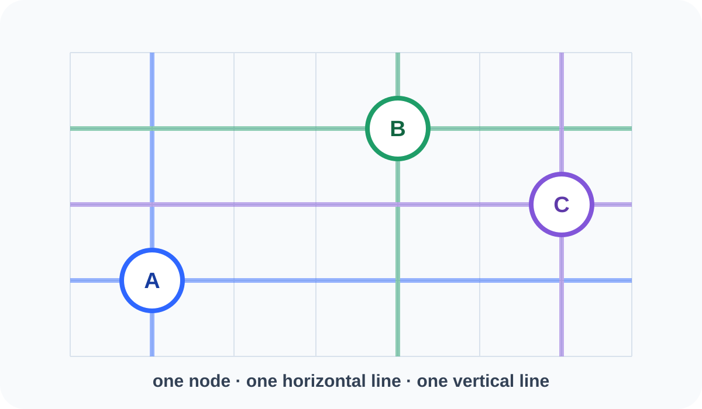
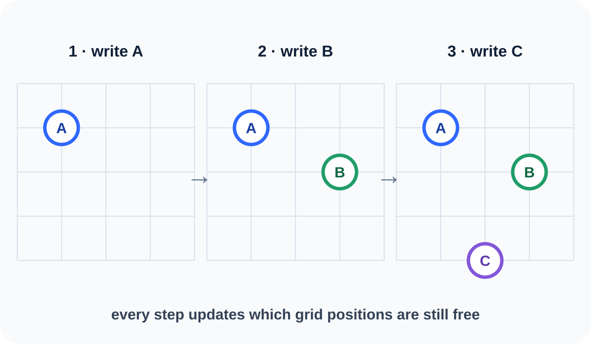
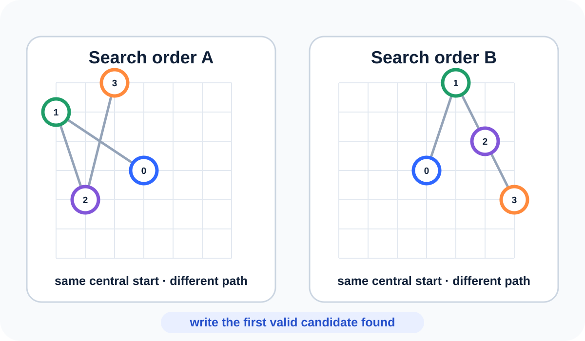
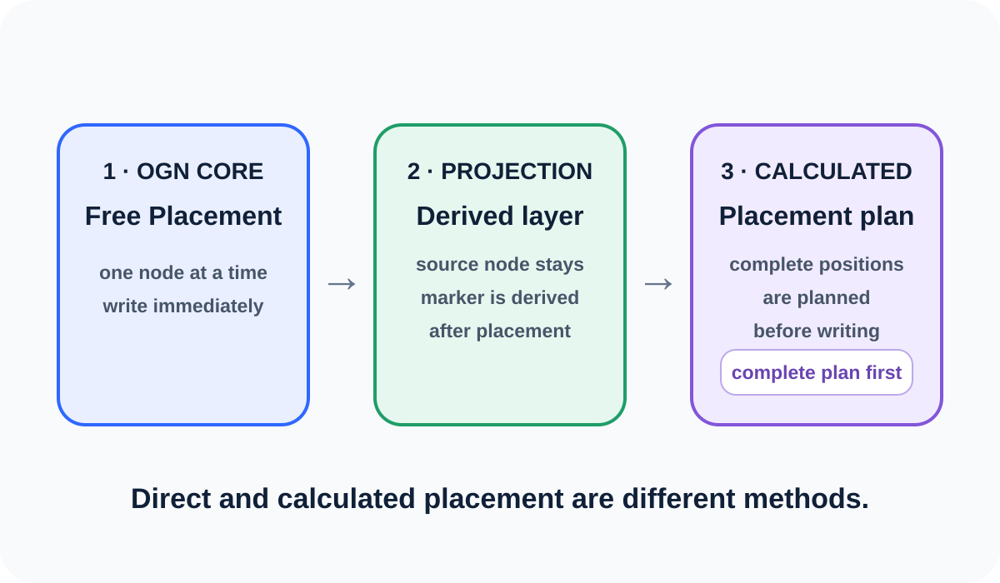

# OpenGraph Lite Viewer v2.0.0-rc.45

OpenGraph Lite Viewer is a viewer and test environment for general Open Graph
Notation. This release is built exclusively on the uploaded
`v2.0.0-rc.26` source through rc.27; rc.28 restores the documented OGN/UI
contracts without importing source files from the abandoned alternate version
line.

Dutch documentation: [`LEESMIJ.md`](LEESMIJ.md).

> **Validation status:** rc.45 was manually approved on 2 August 2026,
> including the Greedy Grow reconstruction, its evidence boundary, desktop,
> mobile and publication carousel. Automated checks continue to verify the
> geometry and feature invariants.

## OGN Core: free placement first

Open Graph Notation writes nodes one at a time into free positions on an open
grid. Every node owns one horizontal and one vertical grid line.

**Hard rule — A ≠ B:** two different nodes may never occupy the same
horizontal or vertical grid line.

```text
A ≠ B  ⇒  x(A) ≠ x(B)  and  y(A) ≠ y(B)
```

A new node may therefore be written only when both its row and its column are
unused. This also applies to applications. If placement cannot find a valid
row and column, no fallback node is rendered.

A violation is called **grid-line reuse**: horizontal reuse shares a row;
vertical reuse shares a column. Both are always invalid.

```text
current occupancy
→ free positions
→ rule set
→ search strategy tests candidates
→ write the first valid position immediately
```

A rule set determines which free candidates are valid. A **Search Strategy**
determines the order in which candidates are tested. Direct placement writes
the first valid position found immediately; another search order may therefore
produce another picture.

**Greedy Grow has an accepted reconstruction.** It starts at the
central grid point and writes one dot per step without storing a future
layout. The historical four-arm order reproduces the preserved 12-, 31- and
96-node demos exactly; four recovered experimental search orders make their
different growth pictures inspectable. Field size and perimeter are shown as
diagnostics, not as a proven global optimum. Open
[`greedy-grow.html`](greedy-grow.html) and see the
[`technical reconstruction`](GREEDY_GROW_RECONSTRUCTION.md). Publication
slide 5 is derived directly from the same accepted engine.

The explanatory order is fixed:

1. **OGN Free Placement** — write nodes one by one into free grid positions;
2. **OGN Projection** — derive markers or orderings from already placed source
   nodes;
3. **OGN Calculated Placement** — let an application calculate a placement
   plan first.

See [`OGN_CORE_PLACEMENT_ARCHITECTURE.md`](OGN_CORE_PLACEMENT_ARCHITECTURE.md).

## Current calculated application: Two-Pass Language Tree

The current viewer implements a **Two-Pass Language Tree** as one calculated
OGN application. Its `OGN Base` profile contains the ordinary
Syntax/Functional tree, grid, the named LEX/SYNT/LOG projections with S/O/V
majors, and examples without optional insertions. The profile name means “base
of this language application”; it is not the definition of OGN Core.
Insertion defaults to off on LEX, SYNT and LOG.

`Config → Pre-config` enables insertion independently per axis without adding
linguistic content. `Config → Applications` then provides **Adverbs** as the
first application. It becomes available only after insertion on **LEX + LOG**
is enabled. When Adverbs is off, its examples, LOG minors, direct LEX
insertions, controls, runtime data, documentation links, and export fields are
absent. OPN exports record `profile: "base"`, `extras: []`, and all three axis
switches.

Config also shows three disabled reservations for later applications:
**Question sentence**, **Emphasis** (for example `juist díe trui`), and
**Incomplete sentence**. They are deliberately outside the active feature
catalogue and therefore add no state, samples, insertions, documentation,
storage, export fields, or rendering behaviour.

## Editable README topics and carousels

`Config → README topics` edits the complete README item, not just its images.
Every topic has a **Show: yes/no** switch, NL/EN navigation titles, and NL/EN
content in limited safe HTML. No hides the topic without deleting it, so it
remains available in Config. Scripts, forms, styles, frames, event attributes,
and unsafe link schemes are removed before custom content is rendered.

The same editor manages the topic carousel: add/remove active slide,
previous/next, wide/narrow shape, NL/EN alt text and captions, live preview,
and full topic reset. A normal path or https URL remains supported.
`Config → Files & export` can additionally insert a local PNG, JPEG, WebP, or
GIF directly as an embedded slide. The limit is 1.25 MB per image and the
combined embedded payload is bounded to protect browser storage. A manually
typed `data:` URL remains blocked; only images created by the trusted file
insertion route are accepted.

The shared Config Save bar now appears above every Config section. It stores
topic text, visibility, and carousel overrides together. Graph shortcuts stay
inactive while Config or README is open and while a form control has focus.

## Default, project-user, and browser Config

Every full project zip contains both
`config/default-config.json` and `config/user-config.json`. The viewer applies
the bundled default first and then the enabled user file as an override. The
default is never physically replaced.

When running through `start_local_viewer.bat`, choose
`Config → Files & export → Write current Config to project`. The local,
allow-listed save endpoint writes the current snapshot to
`config/user-config.json`; this file is then included in the next full-source
zip. On a regular web server, use `Download user config` and put that file in
`config/` manually.

Precedence is:

```text
code defaults → config/default-config.json → config/user-config.json
→ browser-local saved Config
```

The final browser-local snapshot remains device-specific until it is written
to the project user file.

## Ready-to-upload publication carousel

Every project zip includes seven numbered 1080 × 1080 PNG slides under
[`publicatie-carrousel/slides/`](publicatie-carrousel/slides/) and their
single editable, self-contained
[`publicatie-carrousel/index.html`](publicatie-carrousel/index.html) source.
Upload files `01` through `07` in order as one image gallery.

Slide 4 shows nodes projecting to WEST, SOUTH and EAST. Slide 5 is the
**Direct — Greedy Grow** example; slide 6 is the
**Calculated — Language Tree** example, with `HOND · BIJT · MAN` on the west
LEX axis. Both example slides refer to `github.com/kruin/graphlite`.

The carousel is **always derived**. Never edit a PNG or carousel ZIP directly.
If you only want to publish the supplied PNGs, no installation or batch file is
needed. To edit the source on Windows, work in the extracted full project ZIP,
run `installeer-carrousel-tools.bat` once, edit only
`publicatie-carrousel/index.html`, and then run
`maak-publicatie-carrousel.bat`. The installer pins Playwright and its matching
Chromium browser; Node.js 18 or newer is required. The build exports all seven
slides, writes `publicatie-carrousel/derived-manifest.json`, verifies the
source/exporter/PNG hashes, and replaces the sibling carousel ZIP. Run
`maak-volledige-zip.bat` afterwards to put the result into a new full project
ZIP. Local `node_modules` and browser files are never packaged. The standalone
carousel ZIP is also rebuildable, but rebuilding it does not modify a separate
full project folder. The full-source ZIP build stops when the derivation proof
is missing or stale. A final visual check remains required.

[`PUBLICATIE_README.md`](PUBLICATIE_README.md) supplies the exact order,
per-slide alt text, Reddit instructions, and ready-to-copy Dutch and English
text for other platforms. Replace the marked live/source/video URLs before
posting. rc.45 remains a release candidate by version name and was manually
approved on 2 August 2026. Use
[`RC45_OGN_CORE_EXPLANATION_TEST.md`](RC45_OGN_CORE_EXPLANATION_TEST.md) for
the core explanation and carousel check; the inherited rc.43 Config checks remain in
[`RC43_CONFIG_README_PROJECT_TEST.md`](RC43_CONFIG_README_PROJECT_TEST.md).

## Recursive content-sized layout

The structural tree is still placed bottom-up on the HOR/VER grid. Before
drawing, a second recursive pass measures each subtree from its actual node
shapes, labels, child boxes and caption. A small unary box such as
`NP → HOND` therefore uses only its required width and height; larger S, VP and
Functional structures expand independently.

Applications declare abstract layout demands rather than SVG coordinates.
Adverbs, for example, declares that it can add wide LEX insertion content.
The central layout policy reserves the corresponding space. Handheld MAX
includes the complete LEX content and the complete Syntax and Functional rule
boxes in portrait, landscape and forced desktop. LEX reserves only its active
slots and movement lanes, while Syntax and Functional share one stable east
axis over their combined structural grid envelope. See
`RECURSIVE_LAYOUT_AND_APPLICATION_CONTRACT.md`.

### What is recursive now—and what is not

| Stage | rc.42 behaviour |
|---|---|
| Structure and config | Decide which nodes, axes, majors, minors and application contributions exist. |
| Grid placement | Places structural nodes and subtrees on the HOR/VER cell grid. This is not yet text-aware pixel packing. |
| Visual subtree measurement | Measures node shapes, labels, descendant bounds, caption and central padding bottom-up. Only the visible subtree rectangle uses this result. |
| West/LEX placement | Starts from the measured left edge of the active root subtree, then reserves the active LEX slots and movement lanes plus a small clearance. |
| East/SYNT placement | Uses one shared **structural grid envelope** for Syntax and Functional, followed by the complete rule boxes. It is not derived from the measured right edge of every subtree. |
| Viewport fit | Keeps complete LEX content, the central structure, complete rule boxes and LOG inside a stable Syntax/Functional frame. |
| Rendering | Draws the resolved result; it does not add linguistic content or choose new positions. |

This distinction matters. rc.42 has recursive **box measurement**, but it is
not yet a general collision solver that repositions every node when a label
becomes wider. In portrait, the complete left-to-right composition uses the
available width; because that composition is intrinsically wide, text can
remain smaller and vertical whitespace can remain. Pan/zoom is available. A
stacked portrait composition would be a separate future layout decision.

For manual approval, use
[`RC41_RECURSIVE_LAYOUT_TEST.md`](RC41_RECURSIVE_LAYOUT_TEST.md).

## Lexical usage profiles and user disambiguation

This section applies when the Adverbs application is enabled.

OGN does not store an ambiguous form as uncontrolled duplicate dictionary
entries. The lexicon stores one lemma with multiple possible **usage
profiles**; the concrete sentence instance selects the applicable profile.

A profile records origin, function, scope and preferred interval. Origin is
`LOG`, `LEX` or `LOG+LEX`. Only LOG-containing profiles create a south-axis
minor, while all origins receive a destination in the precomputed LEX plan.

Multiword constructions such as `misschien wel` refer to existing lemmas and
may retain one visible LEX slot. When alternatives change OGN notation, the
viewer asks the user. The choice applies only to that sentence instance and
does not rewrite the global lexicon. Config can clear the choices for the
active example.

See `LEXICON_USAGE_PROFILES_AND_DISAMBIGUATION.md`.

## Projection contract

```text
source node → horizontal LEX projection → one direct move to the resolved LEX target
```

`S`, `O` and `V` are majors. An adverbial insertion may be a LOG minor, a direct LEX insertion, or a group combining both origins. Every minor adds one fixed slot to the distance between its bounding
majors. LOG determines the neutral target row, but never the projection
origin: every lexical source first projects horizontally at its source height.
An explicit topic or V2 rule may replace that neutral target before drawing.
The viewer therefore shows at most one LEX-axis move and one source trace per
source word, without an intermediate LOG trace. The example sentence does not
determine layout. See `projectie-master-spec.md`.

## Start

```text
index.html
```

Or run locally:

```bat
start_local_viewer.bat
```

`start_local_viewer.bat` is the only starter. It uses one detected Python 3
installation. First choose **Extract all** for the downloaded ZIP; do not run
the BAT from inside the compressed folder. The BAT only checks that extraction
is complete and starts
`start_local_viewer.py`. That Python launcher controls server detection,
starting, waiting, version validation and opening the browser. It opens
`reset-cache.html` only after port 8088 serves both the exact version and the
exact `SOURCE_BUILD.txt` identity from the current folder. This also catches
an older source package carrying the same rc.45 version number. If the launcher
reports another source, close the old **OpenGraph local server** window and
start the BAT again. The concrete reason remains visible before `Press any key`.

On a large screen, the local `LOKAAL` selector appears at the bottom right.
`mobile portrait` stays inside a 390 × 844 frame and `mobile landscape`
inside an 844 × 390 frame. The large automatic view returns only after
selecting `auto`.

## Build the full source ZIP on Windows

Rename the project directory to the intended release name and double-click:

```bat
maak-volledige-zip.bat
```

The batch file derives the ZIP name from its own containing directory. A
directory named `OpenGraph_Lite_Viewer_v2.0.0-rc.45` therefore produces the
sibling file `OpenGraph_Lite_Viewer_v2.0.0-rc.45_full_source.zip`. An existing
ZIP with that exact name is replaced safely; the script never invents a
`(1)` suffix.

Files matching `*_full_source*.zip` are generated release artifacts, not
project source. This includes a browser download such as
`OpenGraph_Lite_Viewer_v2.0.0-rc.45_full_source (1).zip`. Such copies are
ignored by the manifest and publication checks, are not staged for GitHub
Pages, and are excluded when a new full-source ZIP is built. They may therefore
remain locally without blocking publication, although deleting old copies
keeps the project folder clearer.

GitHub Pages:

```text
https://kruin.github.io/graphlite/index.html?ogv=v2.0.0-rc.45
```

Cache reset:

```text
https://kruin.github.io/graphlite/reset-cache.html?ogv=v2.0.0-rc.45
```

## Desktop view

The readable full-window view is the default. It is shown first under
`Config → View`:

```text
Tree spacing = MAX · large text / low tree
Window fit   = MAX · use full window
```

MAX fits the actually drawn tree and projections to all available desktop
space. The invisible stability frame, grid and helper labels no longer make
the graph and its text artificially small. The same MAX frame remains stable
throughout the phased Play sequence.

### Mobile MAX

On a physical phone, MAX includes the complete LEX content, central structure,
SYNT axis and full rule boxes in both portrait and landscape. Landscape uses a
genuinely lower, wider layout and a contain fit, so the grid top and the
complete LEX, SYNT and LOG axes remain visible at the same time. Two compact
menu rows, the SVG and the Play bar use separate vertical zones. This also
applies when `Interface → Desktop` is forced on the phone. Pan and pinch zoom
remain available for closer inspection.

The grid itself now ends at LEX on the left, SYNT on the right and LOG at the
bottom; it no longer continues past those axes.

## Config tabs

Config follows the dependency order and links to these focused sections:

1. `Pre-config`: insertion independently on LEX, SYNT and LOG;
2. `Applications`: Adverbs requires LEX + LOG;
3. `Overview` and `JaN · TODO`;
4. `Save & export`: LinkedIn/Play/SVG first, followed by OPN, Config
   save/restore and example management;
5. `View`: MAX, Syntax / Functional, tree layout and projection colours;
6. `LOG & LEX`: core LEX order and, when enabled, optional insertions;
7. `Advanced`: legacy branch-extension and top-menu placement options.

`Window fit` means how the tree uses the available app window. It is not a
second application window.

## Social export

Open `Config → Save & export`. The first, highlighted card provides three
local exports:

- `LinkedIn PNG`: a white 1200 × 627 image for an image post;
- `Play video`: an automatic 1200 × 628, fixed-30-fps recording of the
  complete phased Play sequence;
- `Graph as SVG`: a self-contained vector file of the complete current graph.

The recorder now prefers MP4/H.264 when the browser supports it and otherwise
uses WebM. It actively requests all 30 frames per second; the old recorder
captured only changed canvas frames and could therefore fall below LinkedIn's
10-fps minimum. Keep the browser window active until the recording downloads,
then upload it through LinkedIn's Video action. See
[`docs/SOCIAL_EXPORT.md`](docs/SOCIAL_EXPORT.md).

## Read me / README

The `README` / `LEESMIJ` button opens immediately on
**Start · OGN Core**. The topic list and active text remain independently
scrollable in every interface mode.

The first carousel explains the application-neutral core in four steps:
free grid positions, sequential node writing, search order, and the fixed
layer order. It introduces no specialized extension.









The external example-search link opens in a separate browser window. Closing
that window returns the user to the still-open app.

## Play sequence

After the central tree has been built, Play presents the projection process in
three explicit phases:

```text
1. draw the LOG axis and place majors/minors
2. reserve the LOG-derived space on the LEX axis
3. project lexical sources horizontally onto LEX and move each source once to
   its resolved target
```

The target is the LOG-derived row unless an explicit topic/V2 rule replaces
it. SYNT and the remaining projection panels appear in the final step.
The previous-step button now reverses the same sequence exactly: the final
projection layer disappears first, followed by LEX moves, LEX space, LOG and
then the central tree.

## Central views

```text
1. Syntax
2. Functional
```

Syntax shows the syntactic tree. Functional shows the functional structure for the same
example sentence. LOG is not a central view.

## Named projections

```text
LEX    west axis
SYNT   east axis
LOG    south axis
```

LEX, SYNT and LOG are visible by default. Each projection can be disabled
independently. `Geen` shows only the central Syntax or Functional view; `Alle` and Reset
restore every projection. Switching projections does not alter the central
graph, viewport or scale.

Adverbial insertions do not mutate Syntax or Functional. The selected usage profile
determines origin: LOG and LOG+LEX produce a south-axis minor, while a direct
LEX insertion does not. Source nodes project horizontally to LEX and every
origin receives a precomputed neutral LEX target. An explicit topic/V2 rule can
replace that target before one direct visible move is drawn.

The active sentence is printed above the graph, with clear space below it for
a possible future north axis.

## Limited multiword adverbials

The adverb list now includes four deliberately bounded multiword units:
`MISSCHIEN WEL`, `AF EN TOE`, `OP DIT MOMENT`, and
`MET VEEL AANDACHT`. Each complete phrase currently acts as one visible LEX
unit. Its usage profile determines whether it also has a LOG minor, a direct
LEX origin, or a mixed origin; internal syntax is not expanded yet. The set samples
modality, frequency, time, and manner without claiming a complete inventory of
adverbial phrases. See
[`docs/TALIGE_UITBREIDINGEN.md`](docs/TALIGE_UITBREIDINGEN.md).

## Top menu

```text
OGN Base: Sentence · Syntax/Functional · Interface · Projections · LOG order · Language · README · Config
Adverbs on: Sentence · Adverb · Syntax/Functional · Interface · Projections · LOG order · Language · README · Config
```

There is no generic `Menu` button and there are no nested submenus. Choice
items open their own wide panel directly.

## OPN storage

`.opn` is the primary round-trip document format. It separates:

```text
metadata    document identity, format and generator

data        graph, projections and analysis choices

paradata    optional workspace and local session events
```

Paradata may be omitted during export. Older JSON files remain readable as a
migration format; Legacy JSON export remains temporarily available for
debugging. See `OPN_STORAGE_FORMAT.md`.

## Version source

`VERSION.txt` is authoritative for HTML, JavaScript, the service worker, cache
queries, the publication script and the release ZIP name.

## Validation

```bat
node --check viewer.js
check_release.bat
```

## Examples and file controls (rc.18)

- The viewer contains 14 example sentences, including two examples with
  multiple LOG minors.
- With automatic placement, an explicit sentence-instance landing position such as `post-object-pre-vcluster` takes priority over a broad class default. Scope and linear position remain separate.
- `Opslaan als .opn` downloads the current analysis.
- `Importeer .opn` opens a previously exported document.
- Paradata is optional.

## What problem OGN solves

A classical constituent tree often makes horizontal branch order perform two
representational tasks at once: it encodes structural relations and also
suggests the linear order in which the sentence is pronounced. OGN separates
those tasks.

```text
central branching under S = structural relations
LEX projection           = linear sentence word order
```

The same central structure can therefore support different surface strings
without mirroring or rebuilding the tree, or treating word order as a
transformation of the central tree.

## Placement plan before rendering

The viewer calculates one complete placement plan before drawing:

1. determine structural hosts;
2. determine lexical insertions and landing positions;
3. reserve grid space and exchange corridors;
4. place the central tree;
5. fill the core sentence lexically;
6. fix projections, traces and exchange paths;
7. assign growth/render steps;
8. render the fixed result.

The renderer does not choose new positions or reserve new space. Play/Growth
reveals the precomputed layout step by step.

## JaN TODO

- Working notation: `S:np-VP`, explicitly not `S:NP-VP`.
- Research notation: `S+ np-VP`.
- Binary trees first; non-binary multi-branching trees later.
- Verbal-cluster flip: `heeft gebeten` ↔ `gebeten heeft`.

## Resizable README panel

In the built-in README, drag the separator between the topic list and the selected text to enlarge or reduce the text panel. The separator works horizontally on desktop/landscape and vertically on portrait screens.
