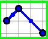
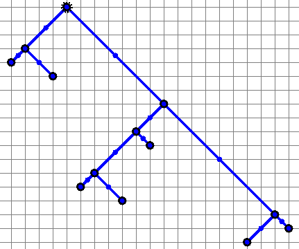
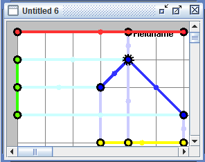
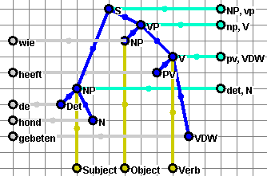

# Flip in Language Tree — generieke bewerking en gezamenlijke constraintsolver

Normatief ontwerpcontract voor flip in Language Tree en zijn extensies.

## Reikwijdte

Flip is geen algemene OpenGraph- of Free-Node-bewerking. Zij bestaat alleen
binnen **Language Tree** en **Anafoor · multiple Language Trees**. De vrije
knopen blijven OpenGraph-knopen; de flipsolver is uitsluitend de technische
plaatsingsmethode waarmee toegestane Language-Tree-vertakkingen een geometrie
krijgen. Greedy, Random en Direct kennen dit flipcontract niet.

De solver verandert nooit de uiteindelijke uiting. **LEX is het ultieme
resultaat** en bewaart zijn gedeclareerde woordvolgorde, behalve wanneer een
branch uitdrukkelijk `linearization: "child-order"` declareert.

## Visuele basis



De minimale boom toont het object waarop Flip werkt: één gedeclareerde binaire
vertakking. De solver wisselt de plaatsingsvariant van de twee volledige
child-subtrees; hij verandert geen knoop-id, categorie of grammaticale relatie.



De historische OpenGraph-afbeelding maakt beide plaatsingsdimensies zichtbaar:
takken kunnen naar links of rechts lopen en kort of lang zijn. Zij blijven
schuin omdat verschillende vrije knopen geen rij of kolom delen.





De laatste twee afbeeldingen tonen waarom Flip tot de Language Tree beperkt
blijft. De centrale boom kan geometrisch spiegelen, terwijl LEX, SYN en LOG
afzonderlijke projecties blijven. Vooral LEX mag niet stilzwijgend met de boom
mee omkeren: LEX is de gerealiseerde uiting.

In PLAY heeft de solver een eigen zichtbare stap tussen `K2 vóór Flip` en de
starre uitlijning. Tijdens die stap blijft de oude K2 rood-transparant zichtbaar,
staat de gekozen K2-layout vol in beeld en verbinden gestippelde lijnen iedere
verplaatste knoop met zichzelf. Daarmee toont PLAY de gekozen solverbewerking;
het toont niet alleen het eindresultaat.

## Besluit

Er komt geen aparte “eerste flip” voor het perfectum en geen hardgecodeerde
volgorde `flip S2 → flip S1`. OGF/Language Tree gebruikt één generieke
branch-flip en kan alle toegestane flips binnen één zoekprobleem kiezen.

`HEEFT GEBETEN ↔ GEBETEN HEEFT` is de kleinste regressiefixture voor die
generieke bewerking. Het is geen afzonderlijk algoritme en geen voorwaarde die
eerst in productie moet worden uitgevoerd voordat de anafoorextensie kan
worden geconfigureerd.

## Vier varianten van een binaire vertakking

Een flip geldt voor precies één gedeclareerde vertakking met twee complete
child-subtrees A en B. Zij heeft twee onafhankelijke plaatsingsdimensies:

1. **links–rechts**: welke child aan welke zijde van de parent staat;
2. **kort–lang**: welke child de korte/hoge en welke de lange/lage plaats krijgt.

Daaruit volgen exact vier varianten:

| Variant | A | B | LEX-childvolgorde |
|---|---|---|---|
| `normal` | links–kort | rechts–lang | A, B |
| `left-right` | rechts–kort | links–lang | A, B |
| `short-long` | links–lang | rechts–kort | B, A, uitsluitend bij `linearization: "child-order"` |
| `both` | rechts–lang | links–kort | B, A, uitsluitend bij `linearization: "child-order"` |

Kort en lang duiden dus **plaatsingsafstand** aan, niet de omvang van de
subtree. Links–rechts verandert op zichzelf nooit de woordvolgorde. Alleen een
expliciet lineariserende branch, zoals een werkwoordcluster, projecteert
kort–lang tevens als omgekeerde childvolgorde op LEX.

Iedere variant:

- behoudt knoop-id’s, categorieën, grammaticale rollen en interne topologie;
- verplaatst geen losse knoop;
- is geen V2-verplaatsing of anafoorprojectie;
- wordt vóór de definitieve recursieve plaatsingsberekening gekozen.

Een n-aire vertakking wordt in deze versie niet impliciet gespiegeld. Daarvoor
moet later een expliciete permutatiebewerking worden gedeclareerd.

## Eerste fixture: dubbele anafoor met perfectumcluster

De productiefixture is **De man slaat de hond omdat die hem heeft gebeten**.
De centrale bomen bevatten `HOND(S1)↔HOND(S2)` en
`MAN(S1)↔MAN(S2)`; LEX realiseert die S2-bronnen als respectievelijk
`DIE` en `HEM`. `OMDAT` is een Context-insertie.

De binaire vertakking `mf-s2-vcluster` bevat `HEEFT` (AUX) en `GEBETEN`
(voltooid deelwoord):

| Configuratie | Child-volgorde | Zichtbare clusterlezing |
|---|---|---|
| `normal` of `left-right` | `HEEFT, GEBETEN` | HEEFT GEBETEN |
| `short-long` of `both` | `GEBETEN, HEEFT` | GEBETEN HEEFT |

De test moet aantonen dat één flip uitsluitend deze twee complete children
omkeert en dat alle identiteiten en rollen gelijk blijven.

Een hoofdzin als `HOND HEEFT MAN GEBETEN` bevat daarnaast een afzonderlijke
V2-regel: de persoonsvorm `HEEFT` vult LEX-slot 2. De branch-flip bepaalt de
bronvolgorde in het V-cluster; de LEX-Wissel bepaalt de hoofdzinrealisatie. Die
twee bewerkingen mogen niet worden samengevoegd.

## Waarom gezamenlijk oplossen

Bij meerdere referent–anafoorrelaties kunnen verschillende branches van S1 en
S2 invloed hebben op de vereiste kolommen. Een vaste procedure “probeer eerst
S2, daarna S1” kan een geldige of betere combinatie missen. Daarom krijgt
iedere gedeclareerde binaire branch één vierwaardige plaatsingsvariabele in
één gezamenlijke kandidaatconfiguratie.

De solver kiest tegelijkertijd:

- nul of meer gedeclareerde branch-flips in S1;
- nul of meer gedeclareerde branch-flips in S2;
- één starre verschuiving van de complete S2-eenheid.

De invoer is altijd één vooraf gekozen `interpretationId` met een complete
set `relations[]`. Flip lost alleen geometrie op. Het mechanisme mag bij
ambigue voornaamwoorden geen referenten omwisselen om de layout passend te
maken.

Voor `zijn bot` blijven daarom de lezingen `bezitter=Jan` en `bezitter=Jek`
een expliciete TODO. De solver mag deze ambiguïteit niet oplossen op grond van
de fraaiste of kortste tekening.

Voor een kandidaatlayout en relatie `i` is de vereiste horizontale
verschuiving:

```text
dx_i = x(referent_i) - x(anaphor_i)
```

Eén starre S2-verschuiving kan alle vereiste kolomrelaties tegelijk oplossen
als en slechts als alle `dx_i` gelijk zijn. Na iedere gezamenlijke
flipconfiguratie worden deze waarden opnieuw berekend. Ongelijke waarden zijn
een ongeldige kandidaat; de solver mag dan geen afzonderlijke knoop forceren.

## Constraints en doelen

De volgorde is normatief:

1. voldoe aan alle relaties met `alignment.required = true`;
2. behoud per Language Tree de unieke rij- en kolominvariant;
3. behoud beide bomen intern; na berekening mag alleen de complete S2 star
   verschuiven;
4. minimaliseer het aantal flips;
5. minimaliseer daarna het aantal gewijzigde dimensies; `both` wijzigt er
   twee, `left-right` en `short-long` ieder één;
6. minimaliseer daarna de absolute starre verschuiving;
7. gebruik bij verdere gelijkstand een stabiele lexicografische volgorde van
   unit-id en branch-id.

Een optimumdoel mag nooit een harde constraint opheffen.

## Config-notatie

```json
{
  "layoutResolution": {
    "schema": "ogn-joint-flip-constraints-v1",
    "mode": "joint",
    "variables": [
      {
        "id": "branch-flips",
        "type": "branch-flip",
        "units": ["S1", "S2"],
        "candidates": "declared-flippable-branches",
        "operation": "binary-placement-variant",
        "dimensions": ["left-right", "short-long"],
        "variants": ["normal", "left-right", "short-long", "both"]
      },
      {
        "id": "s2-shift",
        "type": "rigid-shift",
        "unitId": "S2",
        "axes": ["x", "y"]
      }
    ],
    "constraints": [
      {
        "id": "required-alignments",
        "type": "relation-alignment",
        "source": "relations[*].alignment",
        "requiredOnly": true
      },
      {
        "id": "unit-grid-invariant",
        "type": "unique-row-and-column",
        "scope": "per-unit"
      },
      {
        "id": "preserve-units",
        "type": "rigid-after-layout",
        "units": ["S1", "S2"]
      }
    ],
    "objective": [
      "satisfy-required-relations",
      "minimize-flip-count",
      "minimize-changed-dimensions",
      "minimize-rigid-shift"
    ],
    "branches": [
      {
        "id": "s1-root",
        "unitId": "S1",
        "nodeId": "mf-s1-s",
        "variants": ["normal", "left-right", "short-long", "both"],
        "linearization": "none"
      },
      {
        "id": "s1-vp",
        "unitId": "S1",
        "nodeId": "mf-s1-vp",
        "variants": ["normal", "left-right", "short-long", "both"],
        "linearization": "none"
      },
      {
        "id": "s2-vcluster",
        "unitId": "S2",
        "nodeId": "mf-s2-vcluster",
        "variants": ["normal", "left-right", "short-long", "both"],
        "linearization": "child-order"
      }
    ],
    "firstFixture": {
      "id": "perfectum-vcluster-order",
      "nodeId": "vp-perfectum",
      "alternatives": ["aux-vdw", "vdw-aux"]
    },
    "onConflict": "report-no-forced-node-move"
  }
}
```

`branches[]` begrenst de concrete zoekruimte per combinatie. Zonder zo’n
declaratie is een branch niet flippable. Config kan per branch `auto` kiezen
of precies één van de vier varianten afdwingen. Een afgedwongen combinatie
die niet alle vereiste relaties kan uitlijnen, wordt als conflict geweigerd.

## Deterministische zoekprocedure

Voor `k` gedeclareerde binaire branches zijn er maximaal `4^k`
plaatsingsconfiguraties. Als een branch minder varianten toestaat, is het
werkelijke aantal het product van de aantallen toegestane varianten. Alleen
expliciet gedeclareerde branches tellen mee; daardoor blijft de zoekruimte
klein en controleerbaar.

Per kandidaat:

1. pas de plaatsingsvariant per branch toe zonder de bronboom te muteren;
2. bereken S1 en S2 ieder volledig met Language Tree;
3. valideer de invariant per eenheid;
4. bereken `dx_i` voor alle gedeclareerde Text-coreferenties met
   `alignment.type = "shared-column"` en de noodzakelijke verticale afstand;
5. verwerp de kandidaat als vereiste `dx_i`-waarden verschillen;
6. verschuif S2 eenmaal star;
7. valideer alle relaties en kruis-eenheidconflicten;
8. bereken de objectiefscore.

De renderer ontvangt uitsluitend de gekozen, volledig berekende kandidaat en
neemt zelf geen flip- of plaatsingsbeslissing.

## Actieve implementatie

De anafoorweergave enumereert de vier toegestane varianten van alle
gedeclareerde branches over S1 en S2, berekent iedere kandidaat recursief en
kiest daarna één gezamenlijke oplossing plus één starre S2-shift. De keuze
en de gevraagde Config-overrides worden in OPN en paradata gerapporteerd.

Voor de fixture **De man slaat de hond omdat die hem heeft gebeten** zijn drie
branches gedeclareerd. De volledige ruimte telt `4³ = 64` kandidaten; 16
kandidaten voldoen aan beide uitlijningen. De deterministische standaardkeuze
is:

```text
s1-root     = left-right
s1-vp       = left-right
s2-vcluster = normal
```

Daarmee zijn `HOND(S1)↔HOND(S2)` en `MAN(S1)↔MAN(S2)` gelijktijdig
uitgelijnd. Een geforceerde ongeldige combinatie levert `FLIP CONFLICT` op;
de compositor verplaatst nooit een losse knoop.

Play behandelt de uiteindelijk gekozen niet-normale branches per zin in één
atomaire flipstap. Terugspelen herstelt exact de voorafgaande varianttoestand.
Context-inserties hebben geen Text-knoop en leveren geen flipconstraint;
nadere Context-modellering blijft p.m.

In de gedetailleerde Uiting-Play bewaart de renderer daarvoor twee expliciete
K2-toestanden: `before` toont K2 na haar eigen Language-Tree-berekening en
`applied` toont dezelfde K2 na de gekozen branchvarianten. Daarna volgt pas de
starre `dx`/`dy`-translatie van de complete K2 en verschijnen de verticale
relaties. LEX verschijnt als laatste en bewijst dat Flip geen impliciete
omkering van de uiting heeft veroorzaakt.

De literatuurcatalogus `ANAPHOR_S1_S2_LITERATURE_CATALOG.md` bevat de eerste
meervoudige regressiefixtures. Met name `BOER→HIJ` plus `EZEL→HEM` maakt
zichtbaar waarom alle vereiste verschuivingsverschillen `dx_i` in één keer
moeten worden getoetst.
